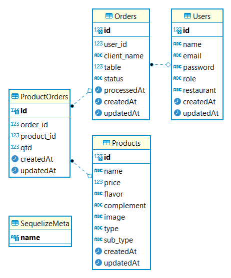

# Urban Bistro - API

## Índice

-   [1. Introdução](#1-Introdução)
-   [2. Estrutura do banco de dados](#2-estrutura-do-banco-de-dados)
-   [3. Utilização](#3-utilização)
-   [4. Desenvolvimento](#4-desenvolvimento)
-   [5. Desenvolvedora](#5-desenvolvedora)

## 1. Introdução

A interface <b>front-end</b> da aplicação <a href= "https://urban-bistro.vercel.app/" target="_blank">Urban Bistro</a> já foi criada e consiste no gerenciamento de pedidos e sincronizar as informações de comandas entre cozinha e salão. O objetivo dessa aplicação era criar servidor web que através de uma <b>API rest</b>, integrada a um banco de dados relacional, fornece métodos de manipulação <b>CRUD</b> seguindo o modelo de arquitetura <b>MVC</b> (Model View Controller).

## 2. Estrutura do banco de dados

Um banco de dados é uma coleção de dados inter-relacionados, representando informações sobre um domínio específico.

 

 
 

## 3. Utilização e documentação

Você pode acessar a <a href= "https://urban-bistro.herokuapp.com/swagger" target="_blank">documentação da API</a> que auxilia no entendimento das rotas e possibilita a execução das requisições.

## 4. Desenvolvimento

:gear: Para esse projeto foram usados:

-   Node.js
-   Express
-   Sequelize
-   Heroku
-   PostgreSQL
-   Postman
-   ESLint
-   DBeaver
-   Swagger

## 5. Desenvolvedora

:mailbox: Entre em contado com a desenvolvedora **Caroline Costa**:

:pushpin: [GitHub](https://github.com/CarolineSCosta)

:pushpin: [LinkedIn](https://www.linkedin.com/in/carolinescosta/)

 </img>

Esse projeto foi desenvolvido no <a href="https://www.laboratoria.la/br" target="_blank">Bootcamp da Laboratória Brasil</a>

<h4 align="center"> © 2021 - <a href= "https://creativecommons.org/licenses/by-nc-nd/4.0/deed.pt_BR" target="_blank">Alguns direitos reservados</a></h4>
